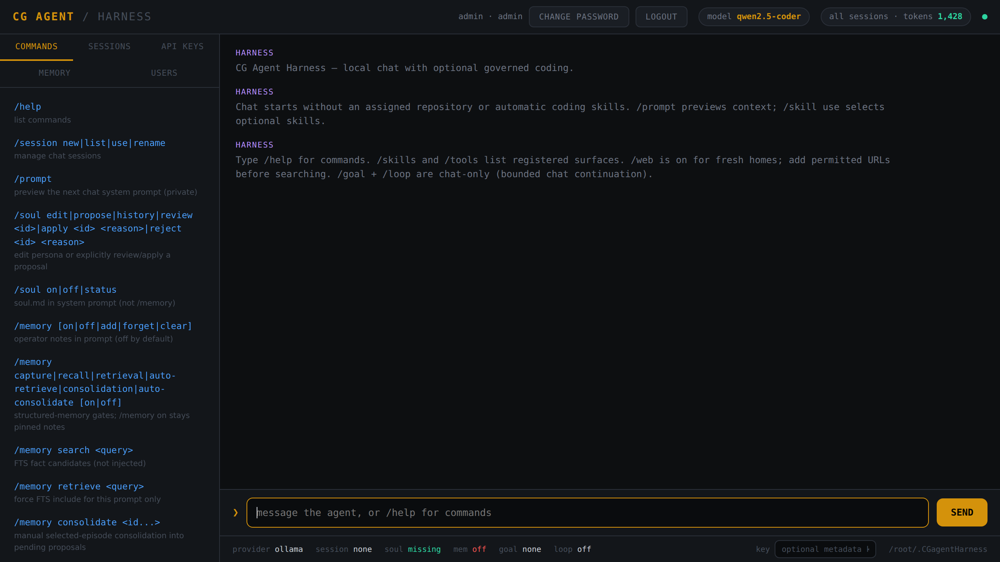

# CG-Agent

[](https://github.com/cgfixit/CG-agent-harness/actions/workflows/ci.yml)
[](https://github.com/cgfixit/CG-agent-harness/actions/workflows/bundle.yml)



A local harness for **chat, permitted web research, and reviewed coding**.

Use the universal macOS app or run the Rust backend in a browser. Local chat
uses an OpenAI-compatible **loopback** model server. Explicitly selecting
`grok` or `claude` enables a separate cloud-chat path after provider setup;
it sends only the new user message, without local history, memory, skills,
attachments or web context. Cloud chat is unavailable for `/loop`.
The coding planner is separate and ships closed behind six gates, including
per-run `--confirm-online`. Enabling that planner permits repository-content
egress; read [CODING_PIPELINE.md](docs/CODING_PIPELINE.md) first.

> **Fresh homes require HTTPS and account login; the harness API key is
> optional.** Start with `admin` / `admin`, then replace the password
> immediately. See [secure setup](docs/SECURE_RESEARCH.md). Repository
> mutations remain disabled until explicitly configured, and commit, push, and
> draft PR publication each require a separate operator decision.

**Version scope:** use the source commit in the
[latest release](https://github.com/cgfixit/CG-agent-harness/releases/latest)
to establish feature availability. Cargo package version `0.1.0` alone does not. Identify the installed source with
`Contents/Resources/COMMIT`, the workflow SHA, and `/help`. How tip `main`
relates, and how to upgrade: [setup-guide.md](setup-guide.md).

`/loop` continues chat toward a session goal. `/agent` drives the separate
coding pipeline. Capability table: [CONSOLE.md](docs/CONSOLE.md#what-you-can-do).

Fresh homes load a default soul that asks for human-readable plain text, with
Markdown only when requested. Existing saved personas are preserved. For local
chat, choose `/style concise`, `beginner`, `technical-deep`, or `unslop`; styles
default to off and never edit the soul. Inspect `/soul status` and `/prompt`, and
compare styles in fresh sessions. These are model instructions, not guaranteed
formatting. Details: [Chat workflows](docs/CHAT_WORKFLOWS.md#inspect-and-edit-the-chat-prompt).

Spend summaries and optional completion webhooks are documented in
[Spend and completion notifications](docs/SPEND_AND_NOTIFICATIONS.md), including
which feature PRs the installed build must contain. The Spend view reports
retained usage and available costs; webhooks send only job metadata and stay
disabled until configured. MCP stderr capture bounds are in
[process lifecycle](docs/PROCESS_LIFECYCLE.md#mcp-stdio-diagnostics).

## Quickstart

### macOS app

Download `CG-Agent-Harness-macos-universal.zip` and `SHA256SUMS` from
[Releases](https://github.com/cgfixit/CG-agent-harness/releases/latest).
Verify with `shasum -a 256 -c SHA256SUMS`, extract, then open
**CG Agent Harness.app**. The app owns a bundled backend on an ephemeral
loopback port. Packaging, ad-hoc signing, and desktop limits:
[DESKTOP.md](docs/DESKTOP.md). Historical native matrix:
[DESKTOP_ACCEPTANCE.md](docs/DESKTOP_ACCEPTANCE.md).

From source on macOS:

```bash
git clone https://github.com/cgfixit/CG-agent-harness.git
cd CG-agent-harness
rustup target add --toolchain 1.88 aarch64-apple-darwin x86_64-apple-darwin
rustup target add --toolchain 1.90 aarch64-apple-darwin x86_64-apple-darwin
scripts/package-desktop.sh --universal
```

Full prerequisites and first-run login: [INSTALL.md](docs/INSTALL.md).

### Standalone server

Rust 1.88:

```bash
git clone https://github.com/cgfixit/CG-agent-harness.git
cd CG-agent-harness
cargo build --release --locked
./target/release/cgagentharness serve
# Open https://127.0.0.1:8790 with explicit browser trust; see docs/SECURE_RESEARCH.md
```

`serve` accepts `--host` and `--port` (1024–65535). Any bind host that is not
a loopback address is refused. Linux needs Git, Rust 1.88, and `bwrap` or
`unshare` instead of Xcode. Windows CI and release legs are parked.

### Local model

```bash
ollama list
```

Default endpoint is `http://127.0.0.1:11434/v1`. Select an **exact installed
tag**. Seeded web budgets assume `OLLAMA_CONTEXT_LENGTH=32768` is set **before**
the Ollama process starts. The harness sends no `num_ctx`. Set-and-verify:
[MODELS.md](docs/MODELS.md).

Sign in, replace the bootstrap password, then `/help`. The Commands pane and
help list supported commands alphabetically, including required arguments and
modifiers. Clicking a menu entry fills the input without running it. Typos such
as `/memroy` produce suggestions; corrections are not executed. Use the listed
syntax rather than shell flags such as `--help` or `--dry-run`. Slash tables:
[CONSOLE.md](docs/CONSOLE.md#78-slash-command-quick-reference). Memory:
[MEMORY_SETUP.md](docs/MEMORY_SETUP.md). Web:
[WEB.md](docs/WEB.md). Troubleshooting:
[TROUBLESHOOTING.md](docs/TROUBLESHOOTING.md).

Home is `~/.CGagentHarness` (`CGAGENTHARNESS_HOME`). One server or app per home.

## Links

Repository guidance lives in [`.codex/skills`](.codex/skills) and
[`.claude/skills`](.claude/skills). Start with `cgagentharness-project-guidance`
and `fable-protocol`. Contributor PRs use a driver-prefixed branch, target
`main`, open as drafts, and are checked with `scripts/check-pr-template.sh`.

| Document | Purpose |
|---|---|
| [setup-guide.md](setup-guide.md) | Index and how to choose a run path |
| [docs/INSTALL.md](docs/INSTALL.md) | Install, first run, persistence, tests/CI |
| [docs/MODELS.md](docs/MODELS.md) | Ollama inventory and `OLLAMA_CONTEXT_LENGTH=32768` |
| [docs/CONSOLE.md](docs/CONSOLE.md) | Chat, soul, skills, slash-command tables |
| [docs/MEMORY_SETUP.md](docs/MEMORY_SETUP.md) | Enable steps for pinned notes and structured memory |
| [docs/WEB.md](docs/WEB.md) | Google listings, URL fetch, page research |
| [docs/CODING_PIPELINE.md](docs/CODING_PIPELINE.md) | Optional disarmed coding loop and cloud-planner egress |
| [docs/ACCOUNTS.md](docs/ACCOUNTS.md) | Roles, login, Terminal account commands |
| [docs/TROUBLESHOOTING.md](docs/TROUBLESHOOTING.md) | Symptom table |
| [AGENTS.md](AGENTS.md) | Contributor rules and required verification |
| [INVARIANTS.md](INVARIANTS.md) | Process isolation, guard chain, write policy, clone jail, sandbox |
| [SECURITY.md](SECURITY.md) | Supported surface and how to report a vulnerability |
| [assets/config.default.yaml](assets/config.default.yaml) | Shipped settings and configurable budgets |
| [docs/SECURE_RESEARCH.md](docs/SECURE_RESEARCH.md) | HTTPS, SQLite migration, roles, URL rules, API Keys |
| [docs/DEPENDENCIES.md](docs/DEPENDENCIES.md) | Toolchains, lockfiles, retained pins |
| [docs/CHAT_WORKFLOWS.md](docs/CHAT_WORKFLOWS.md) | Chat-first defaults, persona/skill commands, goal staging |
| [docs/CHAT_STREAMING.md](docs/CHAT_STREAMING.md) | SSE chat streaming and `/loop stop` |
| [docs/API_ROUTES.md](docs/API_ROUTES.md) | Registered HTTP route inventory |
| [docs/USER_MANUAL.md](docs/USER_MANUAL.md) | Operator navigation, spend/notifications and memory howto |
| [docs/SPEND_AND_NOTIFICATIONS.md](docs/SPEND_AND_NOTIFICATIONS.md) | Spend completeness, webhook setup, retries and privacy |
| [docs/STRUCTURED_MEMORY.md](docs/STRUCTURED_MEMORY.md) | Facts, proposals, episodes, explicit recall, facts-only FTS |
| [docs/BOUNDED_EDITS.md](docs/BOUNDED_EDITS.md) | Exact-content edit format, scope and budget |
| [docs/GIT_APPROVAL.md](docs/GIT_APPROVAL.md) | Approval binding, commit/push/publish separation |
| [docs/CONSOLE_JOBS.md](docs/CONSOLE_JOBS.md) | Asynchronous console runs and browser acceptance |
| [docs/PROCESS_LIFECYCLE.md](docs/PROCESS_LIFECYCLE.md) | Child-process timeouts, cancellation, descendant cleanup |
| [docs/OFFLINE_CARGO.md](docs/OFFLINE_CARGO.md) | Locked dependency set for sandboxed Cargo checks |
| [docs/DESKTOP.md](docs/DESKTOP.md) | App ownership, setup/recovery, packaging, distribution limits |
| [docs/DESKTOP_ACCEPTANCE.md](docs/DESKTOP_ACCEPTANCE.md) / [docs/MAC_ACCEPTANCE.md](docs/MAC_ACCEPTANCE.md) | Historical native records. Not current operator procedure |
| [docs/RELEASING.md](docs/RELEASING.md) | Release cadence, tagging, manual preview/publish |
| [docs/PORT_PARITY.md](docs/PORT_PARITY.md) and [docs/parity/](docs/parity) | CyClaw↔harness port ledger |

The harness originated as a Rust port of the console and agentic pipeline from
[CyClaw](https://github.com/cgfixit/CyClaw). Its focus here is local coding,
chat context, controlled tools, and explicit operator review.
