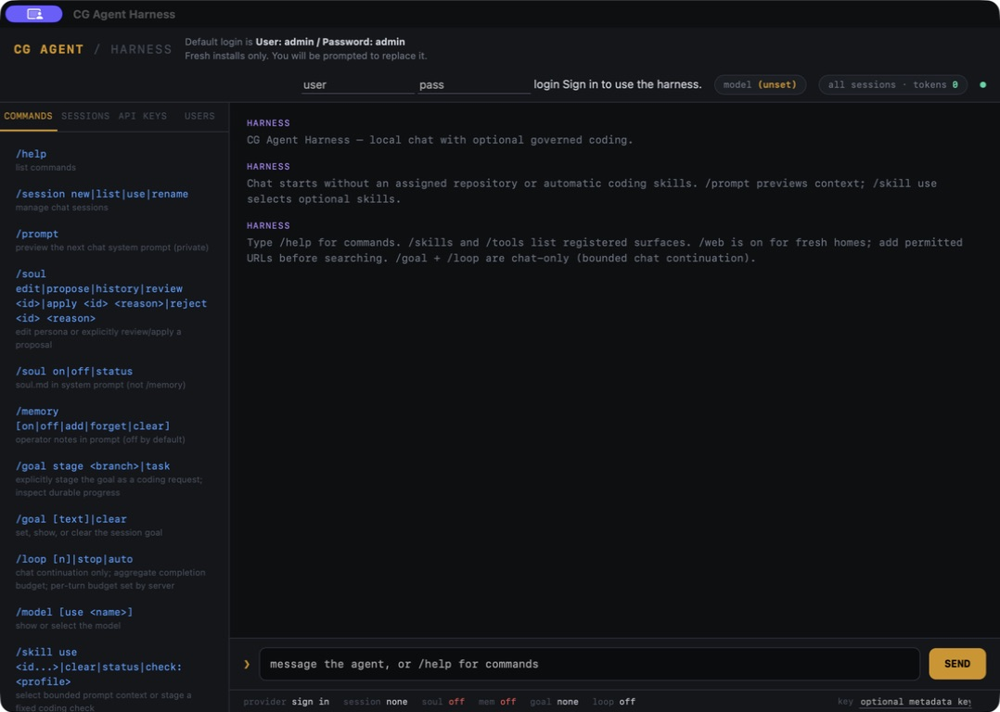

# CG-Agent

[](https://github.com/cgfixit/CG-agent-harness/actions/workflows/ci.yml)
[](https://github.com/cgfixit/CG-agent-harness/actions/workflows/bundle.yml)



A local agentic harness for **coding, chat, and controlled tool use**. Work with a
local model, keep session goals and context, and take repository changes through
a bounded plan → edit → check → feedback loop before reviewing and publishing them.

Use the universal macOS app or run the Rust backend in a browser.
Chat starts without an assigned repository or automatically injected coding
skills. It can discuss supplied context; it does not inspect files or run tools
from a model reply. Coding execution is separately staged and confirmed.
> **Local use needs no harness API key or account login.** Repository mutations
remain disabled until explicitly configured, and commit, push, and draft PR
publication each require a separate operator decision.

## What you can do

| Capability | How it works |
|---|---|
| Chat and context | Select a local model; create, rename, and revisit sessions with saved history and token counts. Set a session goal, toggle `soul.md` persona context, and manage optional operator memory notes. |
| Chat continuation | `/goal` and `/loop` provide bounded follow-up turns with request limits, completion-token budgets, cancellation, and optional auto-continue. |
| Tool visibility and use | `/skills` and `/tools` distinguish registered adapters from readiness and execution evidence. Console commands invoke backend operations through fixed, validated interfaces; model prose does not become an arbitrary shell command. |
| Web context | Explicitly enable allowlisted web fetch/search, inspect fetched text, and inject selected context into chat. Web access ships off. |
| Coding loop | Stage a repository task and inspect files or a plan; confirm an isolated run that proposes bounded edits, runs fixed check profiles in a hard sandbox, and feeds check results back into later attempts. |
| Review and publication | Inspect retained run status and diffs, approve the reviewed tree for a local commit, then separately push and publish a draft PR with a reviewed repository template. |
| Recovery | Rediscover retained jobs and runs after reopening. Worker leases distinguish active work from interrupted runs; reopening does not automatically resume work or replay a publication. |

**There are two different loops:** `/loop` continues chat toward a session goal;
it does not execute repository edits or checks. `/agent` drives the coding
pipeline with its own iteration budget, write policy, and review steps.

## Start the app or server

### macOS desktop (Apple Silicon and Intel)

Download `cg-agent-harness-macos-universal` from a successful `main` run of
[Bundle](https://github.com/cgfixit/CG-agent-harness/actions/workflows/bundle.yml).
Extract its ZIP and open **CG Agent Harness.app** from Finder, Applications, or
the Dock. The app owns a bundled backend on an ephemeral loopback port; ordinary
launch needs no Terminal, external browser, Rust, or Python.

To build the app from source on macOS:

```bash
git clone https://github.com/cgfixit/CG-agent-harness.git
cd CG-agent-harness
rustup target add --toolchain 1.88 aarch64-apple-darwin x86_64-apple-darwin
rustup target add --toolchain 1.90 aarch64-apple-darwin x86_64-apple-darwin
scripts/package-desktop.sh --universal
# dist/CG Agent Harness.app
# dist/CG-Agent-Harness-macos-universal.zip and dist/SHA256SUMS
```

The build requires the toolchains and macOS developer tools described in
[desktop setup](docs/DESKTOP.md). The app is **ad-hoc signed, universal (Apple Silicon + Intel), and not
notarized**. Automated bundle checks do not establish complete native interaction
acceptance; see [the acceptance record](docs/DESKTOP_ACCEPTANCE.md).

### Standalone server

With Rust 1.88 installed:

```bash
git clone https://github.com/cgfixit/CG-agent-harness.git
cd CG-agent-harness
cargo build --release --locked
./target/release/cgagentharness serve
# Open http://127.0.0.1:8790/
```

The standalone CLI/server is one self-reexecuting Rust binary, `cgagentharness`.
Non-loopback binds are refused. The desktop shell is a separate package that
bundles this same backend.

### Connect a local model

Chat and the local planner require a running OpenAI-compatible local inference
server. The default is Ollama at `http://127.0.0.1:11434/v1`.

```bash
ollama list
```

Select the **exact installed model tag** you intend to use. The shipped config
references `qwen3.8:27b-mlx`; that is not proof it is installed, and the suffix
does not establish the execution backend. Set `models.local_llm.model` and
`agentic.deepagent_github.model` in your home's `config.yaml` for chat and planner
respectively. `/model use <name>` changes the console's selected chat model.
A configurable loopback fallback supports another OpenAI-compatible server.

Existing homes keep their settings on upgrade. Mutable config, sessions, notes,
persona, and run evidence live under `~/.CGagentHarness`; an absolute
`CGAGENTHARNESS_HOME` overrides that directory. Replacing the app preserves this
data. Use one server/app per home.

Complete install, configuration, and troubleshooting:
[macOS setup guide](setup-guide.md).

## Work in the console

Start with `/help`, `/status`, `/skills all`, and `/tools`. For a chat session:

```text
/session new
/goal Explain this project's test strategy
/model use <installed-model-tag>
```

Send your question, then use `/loop 3` for a bounded sequence of continuation
turns. The console normally pauses for the operator between turns;
`/loop auto` toggles auto-continue and `/loop stop` cancels it. Server-side
budgets still apply. `/memory` manages optional notes and `/soul` controls persona
context; neither gives the model permission to mutate a repository. A missing
`soul.md` is reported as missing rather than loaded. `GOAL_DONE` is an unverified
model report, not evidence that coding work is complete.

Use `/prompt` to inspect the next chat's system prompt, `/soul edit` for the
confirmed persona editor, and `/skill use <directory-id>` to select optional
bounded prompt context, including the optional seeded `ponytail` and
`karpathy-guidelines` coding skills. `/skill status` shows selection and the last successful
inclusion hashes; `/skill clear` clears it. Repository `.codex/skills` guide
Codex development and are separate from these runtime skills.

`/session new` clears the visible conversation and starts separate message/goal/skill
context. Switching sessions restores only that session’s saved messages. Shared
persona and enabled memory/web context remain; `/prompt` shows them. Chat knows
the operator commands, but cannot execute them. `/memory` lists real saved notes;
`/memory add <note>` saves literal text, not an instruction to archive every session.

To deliberately turn the current goal into coding work, use
`/goal stage codex/<topic>`, inspect the staged request and checks, then
`/agent confirm <reason>`. `/goal task` restores a staged request or shows its
retained job evidence. No coding work starts from ordinary `/loop`.
See [chat, persona, skills and goal controls](docs/CHAT_WORKFLOWS.md) for bounds,
proposal review, recovery and completion semantics.

`/web` exposes the explicit enable/allow/fetch/search/inject controls.
`/connectors` is a catalog, not a claim that every listed connector is executable;
use `/tools <name>` to inspect registration and known prerequisites. This harness does not include CyClaw's RAG corpus,
terminal, or fsconnect/sqlconnect/netconnect services.

## Run a coding task

Coding runs require Git, a logged-in `gh` (version 2.40.0 or newer), the chosen
planner, and the tools for the selected check profiles. Cargo dependency
preparation additionally requires Python 3's standard library. A packaged app
does not supply repository build dependencies or replace the execution sandbox.

The shipped master, deepagent, and Git-write flags are false. To intentionally
arm the pipeline, edit these fields in your existing `config.yaml` and restart:

```yaml
agentic:
  enabled: true
  mode: write
  writes_enabled: true
  repo: "owner/name" # fresh homes leave this empty; explicitly choose a target
  deepagent_github:
    enabled: true
    allow_git_write_tools: true
```

Merge those fields into the existing configuration rather than replacing the
whole file. A typical console sequence is:

1. `/agent run codex/<topic> <instruction>` stages a task; `/agent read` and `/agent checks`
   select context and fixed check profiles. `/agent iterations` sets the attempt
   budget. Use `/help` for each command's arguments.
2. `/agent confirm <why>` starts clone → plan → bounded edit → sandboxed check →
   feedback. This authorizes candidate work in a harness-owned clone, with no
   commit yet. The console polls a detached job; `/agent jobs` and `/agent runs`
   rediscover retained work.
3. Inspect `/agent status <run-id>` and `/agent diff <run-id>`. Approval is bound
   to the reviewed files, modes, and base commit.
4. `/agent approve <run-id> <why>` commits locally. `/agent push <run-id> <why>`
   separately pushes the approved commit.
5. `/agent pr-body <run-id>` loads and previews a completed repository PR template;
   `/agent publish <run-id> <why>` separately creates the draft PR.

CLI mutations require `--reason=<why> --confirm`; API mutations require a reason
and `confirm: true`. Combined approval/push/publication is refused.

Prepare the selected unchanged `Cargo.lock` before Cargo verification using
[offline Cargo preparation](docs/OFFLINE_CARGO.md), available through desktop
Setup or the preparation helper. Missing preparation refuses before invoking
the planner. On macOS, checks receive read-only candidate/source/toolchain inputs
and fresh writable scratch, with network access denied. Tests must write temporary
state under the supplied temporary directory. See [bounded edits](docs/BOUNDED_EDITS.md)
and [Git approval](docs/GIT_APPROVAL.md) for scope, reviewed-tree checks, and limits.

## Optional credentials and enforced boundaries

Fresh homes set `security.api_key_optional: true`: direct loopback harness
operations work without a key or account login. For an older home, set that flag
explicitly and restart. Origin, CSRF, request budgets, repository policy, and
approval checks still apply.

To require a key, set `security.api_key_optional: false`, configure
`CGAGENTHARNESS_API_KEY` in the server environment or desktop home's private
`.env`, and restart. Enter the key in the console; it stays in page memory.
Forwarded requests never use the local bypass. Explicitly enforce the key behind
any proxy, including one stripping forwarding headers.

`auth.enabled` retains optional accounts, login sessions, and role-based account
management. It does not gate chat or the coding pipeline. External services
still require their own credentials, including GitHub publication.

The HTTP server reaches agentic execution only by spawning a whitelisted worker
through `src/shim`; it never imports the pipeline implementation. Model output
passes scope, injection, edit-budget, and exact-content checks before candidate
writes. Quoted YAML `"true"` does not enable a gate.

Chat reports upstream HTTP failures as `502 HARNESS_LLM_ERROR` with the model
server's status code. It drops error bodies without reading or logging them,
including at debug level, so a stalled error body does not hold the chat gate.
See [troubleshooting](setup-guide.md#12-troubleshooting) for diagnosis.

`CGAGENTHARNESS_AGENTIC_WRITE_DISABLE=1` disables repository and PR mutations when
inherited by the process. Setting it in another shell does not affect an existing
process. Revoking YAML policy blocks later mutation boundaries; it does not cancel
a command already executing. Native sandbox and descendant-cleanup limits are
recorded in [INVARIANTS.md](INVARIANTS.md) and
[process lifecycle](docs/PROCESS_LIFECYCLE.md).

`/web off` excludes saved web context from subsequent chat and prompt previews;
`/web on` can resume it. `/web forget` deletes the saved extract and context.
A completed search with no hits clears both to prevent reuse of stale results.
See [web setup and controls](setup-guide.md#76-web-fetch-search-and-injected-context) for bounds.

## Tests and CI/CD

```bash
SKIP_LIVE=1 scripts/verify-local.sh  # fmt, clippy, optional installed deny, tests, release build
python3 scripts/test-desktop-backend.py  # built release backend; disposable homes
# Optional, with your configured local inference service running:
scripts/smoke-ollama.sh
```

Set `CGAH_TEST_BINARY` to test another built backend, including the copy inside a
macOS bundle. The Python suite uses only the standard library and a temporary
loopback HTTP model fixture; it downloads no models and makes no cloud inference
requests. Its chat/restart test verifies history, goal, notes, model selection,
token counts, fresh CSRF, and no replay with neither a key nor a login.

| Gate | Evidence and scope |
|---|---|
| [Backend CI](.github/workflows/ci.yml) | PRs, `main`, and reusable release verification: formatting, Clippy with warnings denied, dependency policy, Rust 1.88 compatibility, release builds and verified CLI packaging, and Rust/public-backend tests on Linux and macOS. |
| Coding and chat regression tests | Write-policy revocation, exact edits, clone jail, reviewed Git trees, detached-job cancellation, session/goal gates, loop budgets, and release of failed/cancelled chat claims. See [`tests/`](tests/). |
| Native Cargo acceptance | Required macOS tests prepare locked dependencies, then exercise real Seatbelt restrictions and fixed Cargo checks. Linux/Windows backends do not establish equivalent confinement. |
| [Desktop CI](.github/workflows/desktop.yml) | Bundle PRs/`main`, tag releases, and manual runs reuse this job to build the universal app, run desktop policy and packaged-backend tests, verify signatures/checksums and the extracted bundle, then retain the universal ZIP and checksums as artifacts. |
| Workflow and source checks | Existing actionlint/zizmor, CodeQL, secret scanning, and PR-template workflows remain separate checks. |
| [Release](.github/workflows/release.yml) | Daily at 08:17 UTC, publish the next patch version only if `main` differs from the latest release. Backend CI, CLI packaging, universal desktop checks, and downloaded checksums gate publication. Stable tags and manual preview/publish are also supported. See [release controls](docs/RELEASING.md). |

CI uses deterministic model fixtures and blanks cloud planner keys. Passing it
does not prove real-model quality, complete native GUI behavior, or notarized
distribution. Live Ollama smoke and [native acceptance](docs/DESKTOP_ACCEPTANCE.md)
cover different evidence. Windows CI/release legs remain parked.

## Development and reference

| Document | Purpose |
|---|---|
| [setup-guide.md](setup-guide.md) | macOS setup, output style, slash commands, skills, memory/web configuration, connector limits and troubleshooting |
| [docs/CHAT_WORKFLOWS.md](docs/CHAT_WORKFLOWS.md) | Chat-first defaults, persona/skill commands, goal staging, and recovery |
| [docs/DESKTOP.md](docs/DESKTOP.md) | App ownership, setup/recovery, packaging, and distribution limits |
| [docs/CONSOLE_JOBS.md](docs/CONSOLE_JOBS.md) | Asynchronous console runs and browser acceptance |
| [INVARIANTS.md](INVARIANTS.md) | Process isolation, guard chain, write policy, clone jail, and sandbox guarantees |
| [AGENTS.md](AGENTS.md) | Contributor rules and required verification |
| [assets/config.default.yaml](assets/config.default.yaml) | Shipped settings and configurable budgets |

The harness originated as a Rust port of the console and agentic pipeline from
[CyClaw](https://github.com/cgfixit/CyClaw). Its focus here is local coding,
chat context, controlled tools, and explicit operator review.
