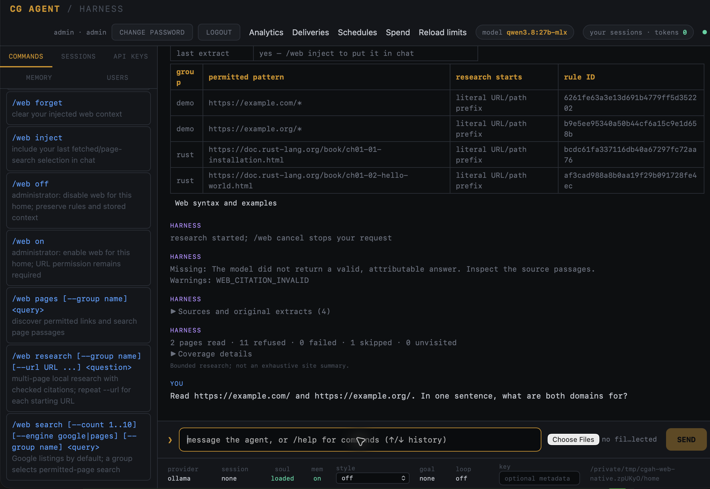

# CG-Agent

[](https://github.com/cgfixit/CG-agent-harness/actions/workflows/ci.yml)
[](https://github.com/cgfixit/CG-agent-harness/actions/workflows/bundle.yml)

A local harness for **chat, permitted web research, and reviewed coding**,
written in Rust. Local chat stays on
loopback. Cloud chat requires provider setup and selection; web reads require
the account and content permissions described in
[SECURE_RESEARCH.md](docs/SECURE_RESEARCH.md#web-permissions).



## What it does

| Surface | What it is | Default state |
|---|---|---|
| **Local chat** | Chat against an OpenAI-compatible **loopback** model server (Ollama by default), with local history, memory, skills, attachments and web context. `/loop` continues chat toward a session goal. | On |
| **Cloud chat** | Explicitly selecting `grok` or `claude` routes through a separate cloud path after provider setup. Sends **only the new user message** — no local history, memory, skills, attachments or web context. Not available for `/loop`. | Off until a provider is configured |
| **Web research** | Google listings, URL fetch and page research under configurable budgets and URL rules. | Governed by [SECURE_RESEARCH.md](docs/SECURE_RESEARCH.md#web-permissions) |
| **Coding pipeline** | `/agent` drives a separate planner/executor loop in a child process. Ships closed behind **six gates**, including a per-run `--confirm-online`. Enabling the planner permits **repository-content egress**. | Off — read [CODING_PIPELINE.md](docs/CODING_PIPELINE.md) first |

Capability table: [CONSOLE.md](docs/CONSOLE.md#what-you-can-do).

> **Security posture, in one paragraph.** Fresh homes require HTTPS and
> account login; the harness API key is optional. First login is
> `admin` / `admin` — replace the password immediately. Repository mutations
> stay disabled until explicitly configured, and commit, push and draft-PR
> publication each require a **separate** operator decision. **Loopback-only**
> means the server listens on a local address such as `127.0.0.1`; it does not
> prove that every subprocess or external model service has no outbound network
> access. Details: [SECURE_RESEARCH.md](docs/SECURE_RESEARCH.md),
> [CODING_PIPELINE.md](docs/CODING_PIPELINE.md#git-approval-and-publication), [INVARIANTS.md](INVARIANTS.md).

## Quickstart

Pick one run path. A **home** is the harness state directory,
`~/.CGagentHarness` (override with `CGAGENTHARNESS_HOME`). Run one server
*or* one app per home, never both.

| Path | What you need | Where the console opens |
|---|---|---|
| Existing macOS app bundle | Apple Silicon or Intel Mac; working local model service for chat | Native app; owned loopback port chosen at launch |
| Build the macOS app | Apple Silicon build host, Git, Xcode Command Line Tools, rustup with Rust 1.88 and 1.90 | Native app after packaging in [macOS app](docs/INSTALL.md#52-macos-app) |
| Standalone server (macOS) | Git, Xcode Command Line Tools and Rust 1.88 | Browser at `https://127.0.0.1:8790/` by default |
| Standalone server (Linux) | Git, a C toolchain, Rust 1.88, and `bwrap` (preferred) or `unshare` for sandboxed checks | Browser at `https://127.0.0.1:8790/` by default |

An already-built app needs no Terminal, external browser, Rust or Python merely
to launch. Coding checks still need their own tools and prepared dependencies.
Full prerequisites, first run and verification: [INSTALL.md](docs/INSTALL.md).

### Option A — macOS app (recommended)

1. Download `CG-Agent-Harness-macos-universal.zip` and `SHA256SUMS` from
   [Releases](https://github.com/cgfixit/CG-agent-harness/releases/latest).
2. Verify, extract, open:

   ```bash
   shasum -a 256 -c SHA256SUMS
   unzip CG-Agent-Harness-macos-universal.zip
   open "CG Agent Harness.app"
   ```

The app owns a bundled backend on an ephemeral loopback port and keeps account
and work data outside the bundle, so replacing the app does not replace that
data. Packaging, ad-hoc signing and desktop limits: [DESKTOP.md](docs/DESKTOP.md).

**Build the app from source** (macOS, both Rust toolchains are required):

```bash
git clone https://github.com/cgfixit/CG-agent-harness.git
cd CG-agent-harness
rustup target add --toolchain 1.88 aarch64-apple-darwin x86_64-apple-darwin
rustup target add --toolchain 1.90 aarch64-apple-darwin x86_64-apple-darwin
scripts/package-desktop.sh --universal
```

### Option B — standalone server

```bash
git clone https://github.com/cgfixit/CG-agent-harness.git
cd CG-agent-harness
cargo build --release --locked
./target/release/cgagentharness serve
```

Open `https://127.0.0.1:8790` and trust the certificate explicitly in your
browser — see [SECURE_RESEARCH.md](docs/SECURE_RESEARCH.md).
`serve` accepts `--host` and `--port` (1024–65535). **Any non-loopback bind
host is refused.**

On Linux, skip the Xcode and app-bundle steps in [INSTALL.md](docs/INSTALL.md).
The backend is built and tested on Linux in CI, and Bundle runs attach a
`cgagentharness-linux-x86_64` binary. The hard sandbox prefers bubblewrap
(allowlisted read-only inputs and writable scratch) and falls back to
`unshare --net` when `bwrap` is missing: that fallback isolates the network but
does not give checks the read-only input confinement that Seatbelt does on
macOS. General Windows CI and release legs are parked; focused native MCP Job
Object acceptance runs on Windows.

### Local model

The harness talks to `http://127.0.0.1:11434/v1` by default and sends no
`num_ctx`, so context length must be set on the Ollama side **before** the
Ollama process starts:

```bash
export OLLAMA_CONTEXT_LENGTH=32768   # seeded web budgets assume this value
ollama list                          # select an EXACT installed tag in the harness
```

Set-and-verify procedure: [MODELS.md](docs/MODELS.md).

### First run

1. Sign in with `admin` / `admin` and replace the bootstrap password.
2. Run `/help`.

`/help` opens a compact topic guide, `/help web` shows research syntax and
`/help all` lists the complete catalog. Clicking an entry inserts its command
prefix for review without executing it; typo suggestions are never executed.
Slash-command tables: [CONSOLE.md](docs/CONSOLE.md#78-slash-command-quick-reference).

### Netconnect

LAN observation ships closed. `netconnect.enabled` and every tier flag in
`assets/config.default.yaml` are false, and `allowed_cidrs` is empty.
`cgagentharness netconnect status` reports gates and does not read local tables.
`cgagentharness netconnect devices` lists in-scope neighbors and sends no packets.
The console LAN tab is a read-only `GET /api/netconnect`. Guide:
[netconnect.md](docs/netconnect.md).

## Which version am I running?

The Cargo package version (`0.1.0`) does **not** establish feature
availability, and a source checkout can include features newer than the
[latest release](https://github.com/cgfixit/CG-agent-harness/releases/latest).
Identify an installed build by `Contents/Resources/COMMIT` inside the app
bundle, the workflow SHA of the build and its release notes; `/help all` lists
the commands that build has. Dated acceptance records certify only the source
and artifact they name. Upgrades, backups and release cadence:
[INSTALL.md](docs/INSTALL.md#update-backup-rollback-and-uninstall) and
[RELEASING.md](docs/RELEASING.md).

## Where to go

| Task or topic | Read |
|---|---|
| Prerequisites, build, [app install](docs/INSTALL.md#52-macos-app), [first run](docs/INSTALL.md#6-first-run), [home, keys and upgrades](docs/INSTALL.md#8-persistence-optional-keys-and-recovery), [verify](docs/INSTALL.md#11-verify-your-setup), tests and CI | [INSTALL.md](docs/INSTALL.md) |
| Choose an installed model; check `OLLAMA_CONTEXT_LENGTH=32768` | [MODELS.md](docs/MODELS.md) |
| Fine-tune `qwen3.8:27b-mlx` and serve it to chat and the coding planner | [FINETUNE.md](docs/FINETUNE.md), [`finetune/`](finetune) |
| macOS app ownership, Finder setup, recovery, packaging, distribution limits | [DESKTOP.md](docs/DESKTOP.md) |
| Chat, sessions and goals, soul, styles (off by default), skills, attachments, connectors, streaming, compaction, slash commands | [CONSOLE.md](docs/CONSOLE.md) |
| Passive LAN observation (`netconnect`, off by default): gates, scope, CLI, `/net`, panel | [netconnect.md](docs/netconnect.md) |
| Operator manual; memory: pinned notes, structured memory, suggestions, recall | [USER_MANUAL.md](docs/USER_MANUAL.md), [MEMORY_GUIDE.md](docs/MEMORY_GUIDE.md), [STRUCTURED_MEMORY.md](docs/STRUCTURED_MEMORY.md) |
| HTTPS and certificates, accounts and roles, web search/fetch/research, URL rules, API keys | [SECURE_RESEARCH.md](docs/SECURE_RESEARCH.md) |
| Spend, draft estimates, completion webhooks and deliveries | [SPEND_AND_NOTIFICATIONS.md](docs/SPEND_AND_NOTIFICATIONS.md) |
| Token, session and coding-run analytics | [ANALYTICS.md](docs/ANALYTICS.md) |
| Reload web/API limits without a restart | [CONFIG_RELOAD.md](docs/CONFIG_RELOAD.md) |
| External MCP servers; private read-only MCP memory gateway | [MCP_CLIENT.md](docs/MCP_CLIENT.md), [MCP_SERVER.md](docs/MCP_SERVER.md) |
| Coding pipeline, after local chat works: arming, bounded edits, offline Cargo checks, retrieval, Git approval | [CODING_PIPELINE.md](docs/CODING_PIPELINE.md) |
| Detached console jobs and reviewed schedules | [CONSOLE_JOBS.md](docs/CONSOLE_JOBS.md) |
| Child-process timeouts, cancellation, output capture | [PROCESS_LIFECYCLE.md](docs/PROCESS_LIFECYCLE.md) |
| Registered HTTP routes | [API_ROUTES.md](docs/API_ROUTES.md) |
| Toolchains, lockfiles, dependency drift | [DEPENDENCIES.md](docs/DEPENDENCIES.md) |
| Release cadence, tagging, manual preview/publish | [RELEASING.md](docs/RELEASING.md) |
| Shipped settings and configurable budgets | [assets/config.default.yaml](assets/config.default.yaml) |
| Symptom table for a failed setup | [TROUBLESHOOTING.md](docs/TROUBLESHOOTING.md) |
| Process isolation, guard chain, write gates, clone jail, sandbox | [INVARIANTS.md](INVARIANTS.md) |
| Supported surface; reporting a vulnerability | [SECURITY.md](SECURITY.md) |
| Remaining CyClaw port work | [docs/parity/STATUS.md](docs/parity/STATUS.md) |

## Contributing

Repository guidance for coding agents lives in [`.codex/skills`](.codex/skills)
and [`.claude/skills`](.claude/skills); start with
`cgagentharness-project-guidance` and `fable-protocol`. Contributor rules and
required verification: [AGENTS.md](AGENTS.md).

PRs use a driver-prefixed branch, target `main`, open as drafts, and are
checked with `scripts/check-pr-template.sh`.

## Origins

The harness began as a Rust port of the console and agentic pipeline from
[CyClaw](https://github.com/cgfixit/CyClaw). Its focus here is local coding,
chat context, controlled tools and explicit operator review.
