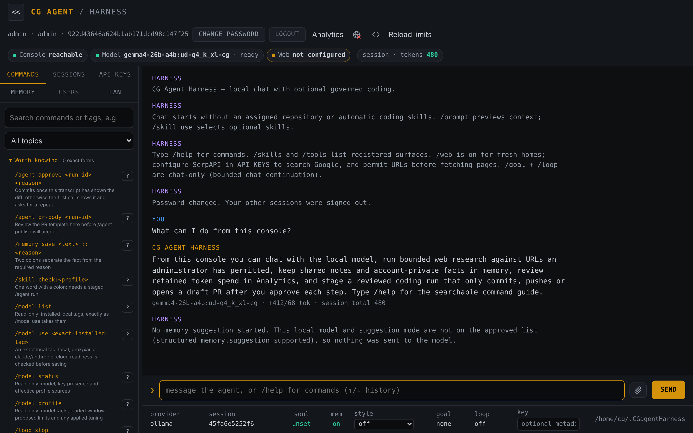
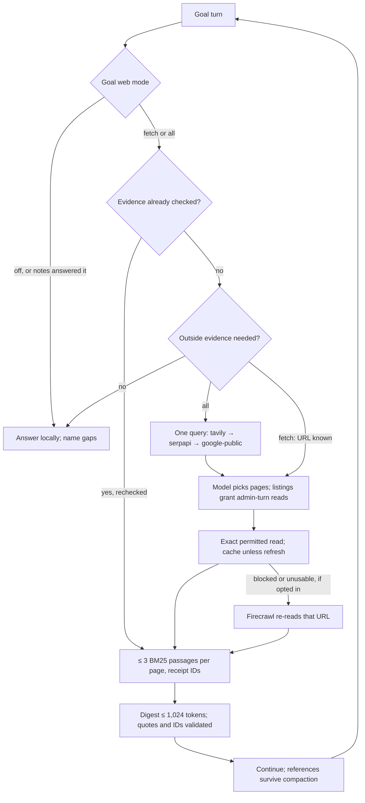

# CG Agent Harness

[](https://github.com/cgfixit/CG-agent-harness/actions/workflows/ci.yml)
[](https://github.com/cgfixit/CG-agent-harness/actions/workflows/bundle.yml)

**An affordable, secure research agent loop on your own machine.** One loopback-only Rust service researches with a local model; cloud calls are optional and capped, and every read obeys your URL rules.

[](docs/screenshots/console-chat-2026-10-30.png)

[60-second demo](docs/screenshots/demo/CG-Agent-Harness-60-second-demo.mp4)

## What you can do

| Capability | What it provides | Fresh-home state |
|---|---|---|
| **Web research** | Search, permitted reads and crawls, `/web research` jobs with checked quotes, local PDF text; paid providers stop at daily ceilings. | On; allowlist with one seeded Google rule. |
| **Goal loops** | `/goal` and `/loop` continue after the tab closes; a counted run ends on its best answer. | 200 turns, 200,000 tokens, two failed turns; local only. |
| **Memory** | Pinned and [uploaded notes](docs/CONSOLE.md#text-file-attachments-and-prompt-preview), account-private facts. | On; proposals need review. |
| **Local chat** | Sessions, transcript search and export, text, DOCX and PDF attachments, skills, styles; no Ollama cloud tags. | Ollama on loopback. |
| **Browser tasks** | `/browse <site> <task>`: the local model drives sandboxed Chrome on those sites only. Password fields are never typed; a held non-GET/HEAD request is sent once if approved. | On for administrators; [setup](#3-sign-in-and-research). |
| **Accounts, diagnostics** | Administrator, operator and auditor roles; token and run history, **Estimate draft**, `/diag` redacted logs. | On; `/diag` admin or auditor. |
| **Cloud chat** | Optional Grok or Claude; only the new message leaves, redacted. | Needs a key. |
| **Off by default** | Reviewed coding in isolated clones, MCP tools and memory gateway, Netconnect, Firecrawl fallback, completion webhooks; native computer use is a closed gate ([#996](https://github.com/cgfixit/CG-agent-harness/issues/996)). | Each needs configuration. |

## How the research loop decides

Code decides permission, budget and deadlines; the model chooses searches, pages and conclusions.


```mermaid
flowchart TD
    A[Goal turn] --> B{Goal web mode}
    B -->|off, or notes answered it| C[Answer locally; name gaps]
    B -->|fetch or all| D{Evidence already checked?}
    D -->|yes, rechecked| H
    D -->|no| E{Outside evidence needed?}
    E -->|no| C
    E -->|all| F[One query: tavily → serpapi → google-public]
    F --> G[Model picks pages; listings grant admin-turn reads]
    E -->|fetch: URL known| G
    G --> I[Exact permitted read; cache unless refresh]
    I -->|blocked or unusable, if opted in| J[Firecrawl re-reads that URL]
    I --> H[≤ 3 BM25 passages per page, receipt IDs]
    J --> H
    H --> K[Digest ≤ 1,024 tokens; quotes and IDs validated]
    K --> L[Continue; references survive compaction]
    L --> A
```

`all` is the shipped goal web mode. The digest proves provenance, not logical support; `GOAL_DONE` stays model advice ([#772](https://github.com/cgfixit/CG-agent-harness/issues/772)).

## Design invariants

Contracts: [INVARIANTS.md](INVARIANTS.md), checked by [the guard](tests/invariant_guard.rs) and focused tests.

- **Loopback only.** Non-loopback binds are refused; fresh homes need HTTPS and login.
- **Process isolation (I6).** Coding runs only as a `cgagentharness agentic …` child behind an allowlisted [shim](src/shim/mod.rs); browser tasks run in a child with no provider keys.
- **Writes are gated.** Gates ship false; approval, push and publication each need a reason and confirmation; a revoked gate stops the run; checks run under Seatbelt or bubblewrap.
- **Current permission.** Reads are DNS-pinned to public addresses; policy and sign-ins are rechecked after waits and before delivery. Replies render as text.
- **Strict config.** Gates need literal YAML `true`; malformed numbers stop startup.
- **Secrets stay out.** Keys live in the OS credential store, never in responses, logs or model context.
- **No telemetry.** Both `deny.toml` files ban telemetry crates; CI enforces it.

Accounts are not tenants ([shared state](SECURITY.md#local-authority-and-shared-resources)).

## Quick start

A **home** is `~/.CGagentHarness` (`CGAGENTHARNESS_HOME`); run one app or server per home. **macOS from scratch:** `scripts/install-macos.sh`, then `scripts/start-macos.sh` ([automated install](docs/INSTALL.md#1-quick-start-automated-macos-install)).

### 1. Prepare a local model

Any OpenAI-compatible loopback service works; the default `qwen3.8:27b-mlx-cg` is a [locally derived tag](docs/MODELS.md#pin-32768-with-a-local-derived-tag). Budgets assume a **32,768-token window**; the harness sends no `num_ctx`:

```bash
OLLAMA_CONTEXT_LENGTH=32768 ollama serve
```

### 2. Run the harness

**macOS app:** download the zip and `SHA256SUMS` from [Releases](https://github.com/cgfixit/CG-agent-harness/releases/latest):

```bash
shasum -a 256 -c SHA256SUMS
unzip CG-Agent-Harness-macos-universal.zip
open "CG Agent Harness.app"
```

Ad-hoc signed ([Gatekeeper](docs/DESKTOP.md)). **Server, macOS or Linux** (Rust 1.89, a C compiler; [Install](docs/INSTALL.md)):

```bash
git clone https://github.com/cgfixit/CG-agent-harness.git
cd CG-agent-harness
cargo build --release --locked
./target/release/cgagentharness serve
```

Open `https://127.0.0.1:8790/`, trusting the [local certificate](docs/SECURE_RESEARCH.md#https-and-native-trust).

### 3. Sign in and research

1. **Set a password** (12+ characters) with the setup code from **Setup and recovery** or `<home>/setup-code`.
2. `/model list`, `/model use <tag>`, `/help`.
3. `/web allow https://example.org/*`, then `/web research <question>`; for longer work, `/goal <question>` and `/loop 3`.
4. Browser tasks: install Google Chrome, run `PLAYWRIGHT_SKIP_BROWSER_DOWNLOAD=1 npm ci --ignore-scripts` in `browser/`, then `/browse docs.python.org what does zipfile.Path do?`.

## Commands and configuration

CLI (`--help` each): `serve`, `account`, `web`, `tls`, `mcp-key`, `netconnect`. Console: [slash reference](docs/CONSOLE.md#78-slash-command-quick-reference). First launch seeds `config.yaml` from [the defaults](assets/config.default.yaml); edit and restart, or **Reload limits** ([reloadable](docs/INSTALL.md#reload-limits-without-a-restart)). Contributors: [AGENTS.md](AGENTS.md). Windows has CI but no release.

## Documentation

[docs/README.md](docs/README.md) indexes every guide, from [the web decision router](docs/WEB_DECISION_ROUTER.md) to [troubleshooting](docs/TROUBLESHOOTING.md).

## License

[MIT](LICENSE).
