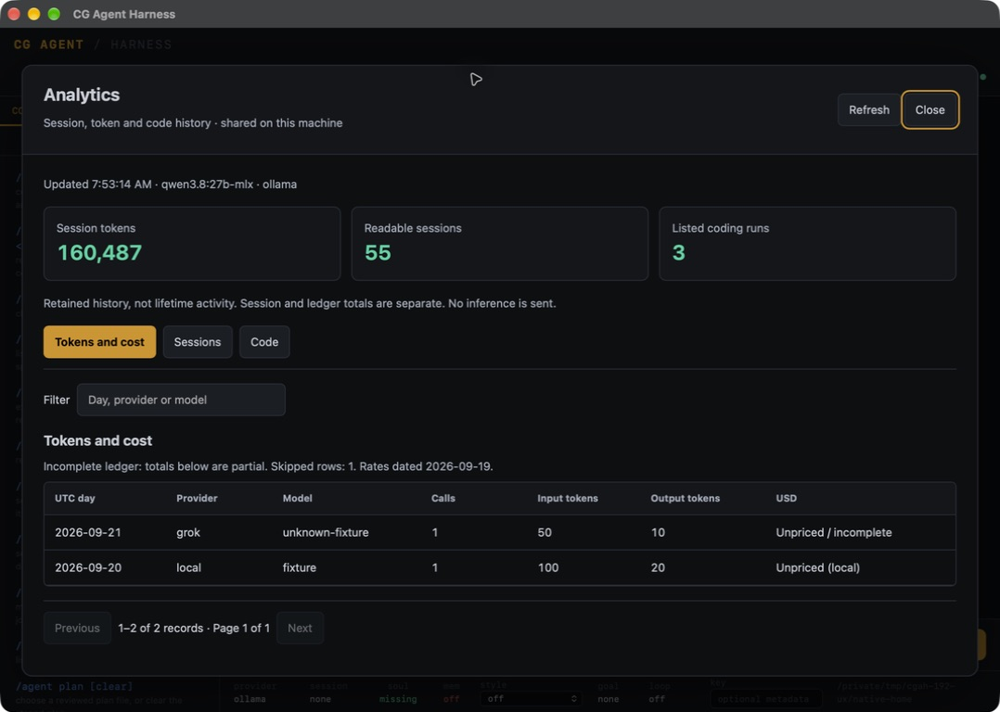
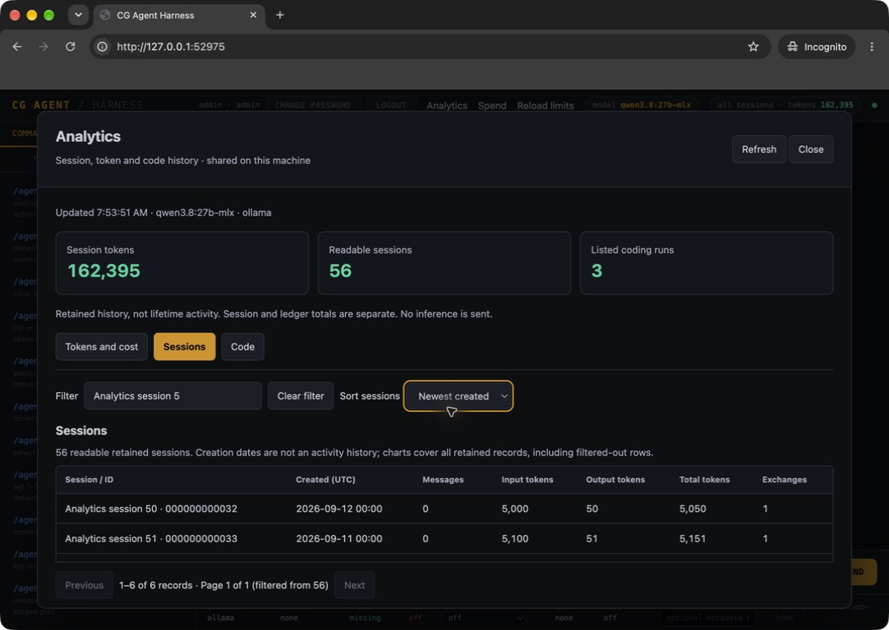
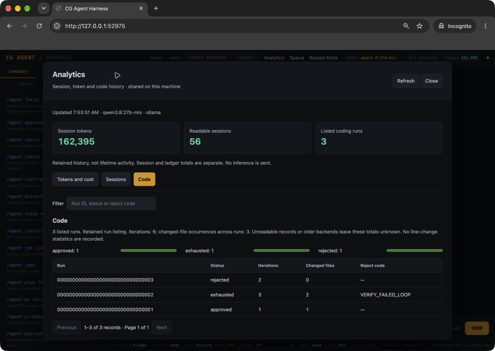
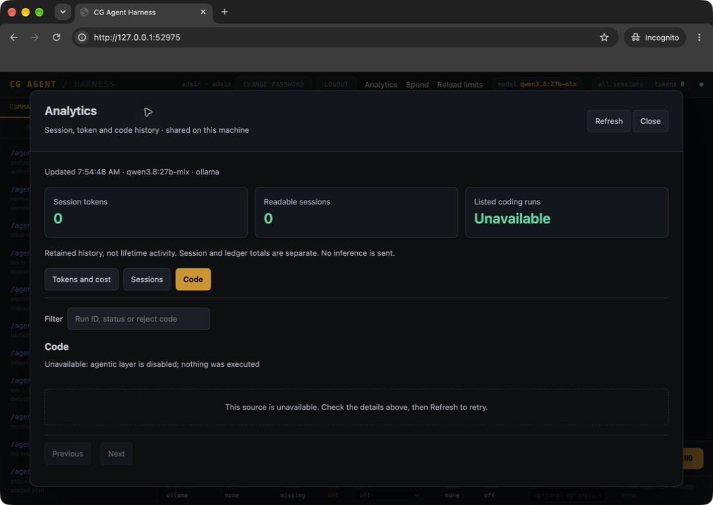
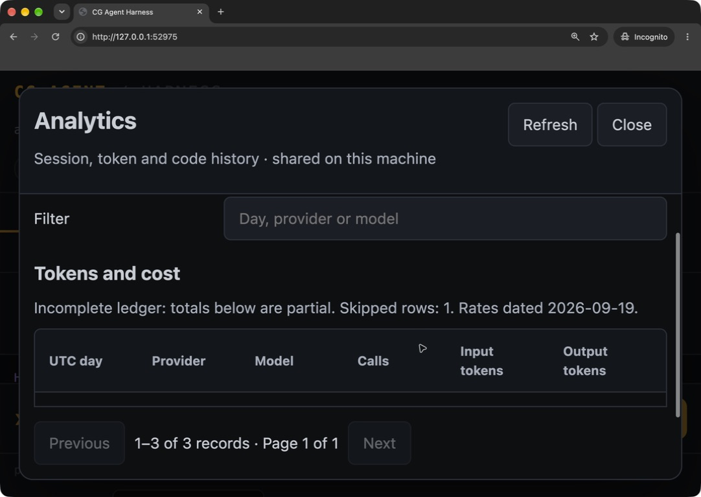

# Analytics Computer Use screenshots

Captured on 2026-09-21 through macOS Computer Use from the final local build
whose runtime source is commit `1a8a77b`. These are unedited app-window captures:
native WKWebView and a Chromium private window with no personal tabs or bookmarks.

The isolated native home contains 55 synthetic sessions and three synthetic coding
runs. The browser home also contains one previously verified live local
`qwen3.8:27b-mlx` chat, so its totals are 56 sessions and 162,395 tokens. Synthetic
coding outcomes are display fixtures, not evidence of executed coding jobs or paid
cloud calls. The empty-state fixture was restored after capture.

The ad-hoc-signed, non-notarized arm64 development ZIP has SHA-256
`efee51a22b3eab9cdcbb4c057dcb338ee3234c4892f6b0814b1ed645aff44e7c`.
Its embedded console HTML has SHA-256
`d2c72076371e558ce35d6cd3a9230eb11ff98fde99021a9ac22fb3f70dfcc0ba`.

## 1. Native overview and honest cost coverage

Retained session totals are separate from the ledger. Malformed ledger rows remain
visible as incomplete coverage, and local or unknown pricing stays unpriced.

## 2. Browser session filtering and sorting

Filtering for `Analytics session 5` produces six matches ordered by newest
creation date. The overview still covers all 56 retained sessions.

## 3. Browser coding outcomes

Approved, exhausted and rejected fixtures retain their iteration counts,
changed-file occurrences and reject code. Captured at 90% browser zoom to show all
three rows together.

## 4. Empty history and unavailable coding

Zero readable sessions and zero session tokens remain distinct from an unavailable
coding source. Disabling the fixture's agentic layer produces an explicit reason
and refresh guidance.

## 5. Responsive browser layout and scrolling

At 200% browser zoom, the effective viewport is about 541 CSS pixels wide. Scrolling
the dialog retains its header and paging controls; the filter fits the narrower
layout and the table keeps its own scroll area. This is desktop zoom evidence,
not a physical mobile-device test.

