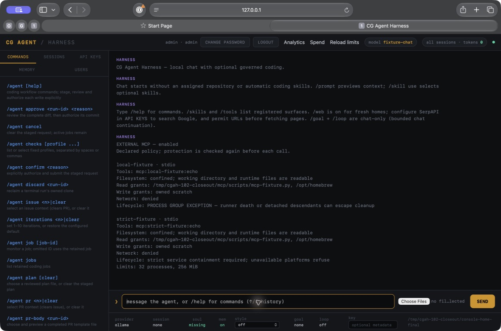
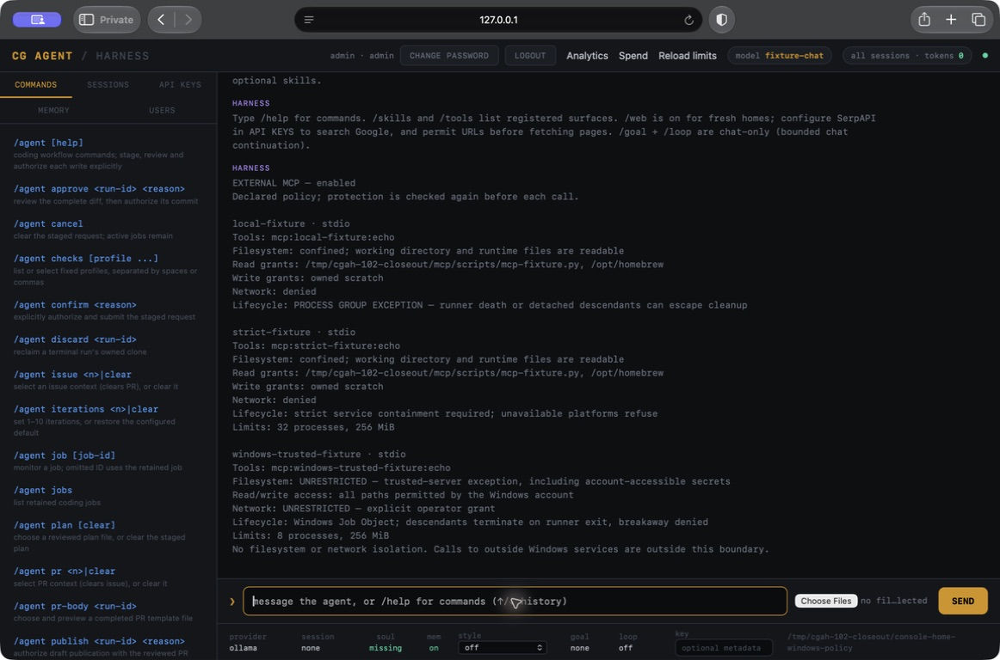

# MCP capability acceptance

Computer Use exercised the real local console with an isolated account/home and
a synthetic local model. The MCP fixture ran under native macOS Seatbelt; a
confirmed echo call succeeded. No provider credentials or external inference
were used.

The policy view shows an explicit process-group exception beside a strict
declaration. Displaying the strict declaration is not evidence that strict
containment runs on macOS: the server refuses it before tool execution. Native
Linux service acceptance is a separate required hosted job.

Local verification before this draft: 646 tests across the full 46-suite run;
after the final runtime-root guard, 371 focused tests passed (329 library,
13 foundations, 12 invariant guards, 17 MCP). Formatting, strict Clippy,
cargo-deny 0.20.2 and actionlint passed. The final candidate also passed all
11 public desktop-backend tests. This is browser/backend evidence, not a native
desktop package or live-model claim.

The final local debug backend SHA-256 was
`5354e6b0adbb75d2558ffbaacf58fcaf067d16e0800f749448bef103034e6dda`.
Source base: `5e00112d5ca4af03c8dc467bcdae8684bcc7331e`, plus this PR's source.

## Platform exception verification

The updated candidate passed 650 tests across 47 local suites (zero failures or
ignored tests), strict Clippy, formatting, cargo-deny 0.20.2, actionlint and
zizmor. Computer Use signed into a fresh disposable account in a private Safari
window and opened `/tools mcp`. The actual macOS backend returned HTTP 403 with
`MCP_CONTAINMENT_UNAVAILABLE` for both the strict declaration and Windows-only
exception. A real confined fixture echo succeeded under Seatbelt.

Debug backend SHA-256 for this second screenshot:
`e5da2e1aabf50107bbc616762d0e74c65e18f8dde094c8de091917237309adc6`.
This proves console reporting and macOS refusal, not Windows execution. The
native Windows job separately exercises detached descendants and crash cleanup.
Linux confinement and service lifecycle jobs passed on `273122db5d47d3e9597c2f237eeb692d197d807c`;
any later commit requires its own hosted result.
